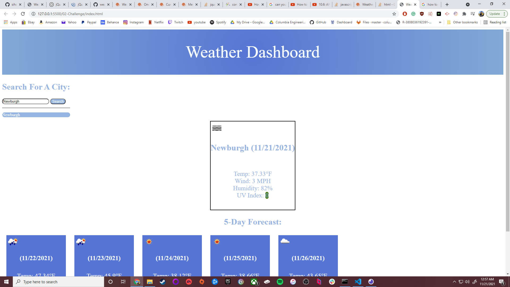

# My-Weather-Dashboard
This is a weather app that I have made and here I'll give a breif overview on why I made this site, how I made it and what I learned in the process.

# Why Did I Make This:
I made this site to try and learn how api calls work and how to use them in interactive ways. In this case checking the weather! I want to keep challenging myself and what I can do and this project was perfect for that

# What I Did To Create This Site:
To give a breif overview on how I made this site I started with linking all the appropriate js that I needed (in this case jquery, moment js, and my own js) and building the layout on the barebones site. I then removed some of the base layout as I would later recreate them dynamically through js. In my concept I wanted the user to type out the city they wanted weather in and then once they hit the search button they would recieve the weather. I needed in js two api calls for what I needed. I used the same api (openweather) however one was purely to get the city name and lat and lon coordinates and the other api call handled the rest. Which in this case was the current day weather and the forecast. Then I made dynamically updated html to assign what i needed to the already created divs in html. These where a list of the weather, an icon representinf what type of weather was occuring and I also used moment js to properly label the current day and forecast days to give them the accurate month, day, and year. I then added a featue where you are able to see whether the current index is good, moderate, or severe. I also then added a feature where it will save the last input you have made that way you can copy and past that input if you want to check that city's weather again. They only issue is that when creating that feature I forgot how to set the limit in my for loop to a set number instead of the whole length of my array because in this case my array is technically infinite. 

# What I learned:
I learned a lot about js in the sense that if you create a function that is already targeting a variable if I call that function again, I can pass a different variable instead of the original ones assigned. I also mainly learned how to properly fetch an api. I found two methods that worked in giving me the value I needed to make this website interactive. I feel like this is such a useful idea to know because if I ever need an api to serve a purpose like this weather app I'm going to be better equiped with the knowledge I learned from this to make whatever I have planned work without me feeling lost on where to begin.
